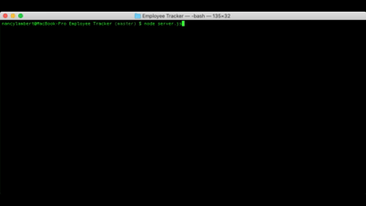

# Employee CRM

[](https://www.gnu.org/licenses/gpl-3.0)


https://github.com/n-lambert/employee-crm


## Introduction:

This project is a command line interface program running in Node.js. It uses a MySQL database to organize employee and department data, and offers the ability to edit that data through the terminal. It uses inquirer.js to interact with user input.

Walkthrough:
[]

## Installation:

To install this project, download the source files from github, and access the folder via your terminal/console of choice. Run npm i to install dependencies (inquirer, mysql, and table), and then use npm start to begin the program.

## Usage:

After installation, launch your MySQL database and install the EmployeeCRM-Schema from the assets folder. You can prepoulate data with the seed.sql file. Once your MySQL database is running run the following command in the working directory:
```
node server.js
```

## License:

MIT

## Credits:

Thanks for tips and/or inspiration

- [Plover Brown](https://github.com/rebgrasshopper)
- [Elliott Jones](https://github.com/JonesElliott)
